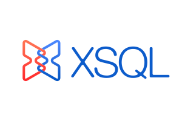

[English](https://github.com/Qihoo360/XSQL/blob/master/README.md) | [中文](https://github.com/Qihoo360/XSQL/blob/master/README-CN.md)

XSQL是一款低门槛、更稳定的跨数据源查询引擎。1）XSQL提供了使用标准SQL读写NoSQL数据库的解决方案，能够大幅降低学习曲线，节省人力成本。 2）XSQL通过对SQL的优化以及一系列监控插件，为用户任务的稳定运行保驾护航。

[https://qihoo360.github.io/XSQL/](https://qihoo360.github.io/XSQL/)

## 功能特性

- 内置8种数据源，包括：Hive、Mysql、EleasticSearch、Mongo、Kafka、Hbase、Redis、Druid等。
- XSQL采用数据源（DataSource）、数据库（Database）、数据表（Table）的三层元信息，为异构数据源提供了统一视图，进而实现了跨数据源的数据关联
- SQL Everything，将程序与数据源具体版本解耦，程序迁移能力得到加强
- 对DDL、DML、可下推查询，延迟与Yarn的交互及资源申请，进而提升效率并节省资源。
- 相比很多开源分布式查询引擎，XSQL替换了Spark SQL，因而只需要一次SQL解析，避免多次解析带来的时延。
- XSQL允许用户将聚合、过滤、投影等操作下推至数据源计算引擎，相比DataSet API更容易实现毫秒级响应。
- XSQL借鉴了业内优秀的开源项目，放弃元数据的中心化，因此避免了数据同步、数据不一致，数据延迟等不利因素。XSQL也因此在部署上更加轻量、简便。
- XSQL对元数据的缓存有两种级别，既能减少对底层数据源的压力，也提升了XSQL的执行效率。
- XSQL可以按照用户需要，设置元数据白名单来避免缓存多余的元信息，进一步提升执行效率。
- 可适配到Spark 2.x任意版本，解压即可运行，不需要引入额外依赖。且与原生SparkSQL隔离运行，不影响现有程序运行

## 编译&部署&运行指南

### 编译环境依赖

- jdk 1.8+

### 编译步骤：

1. 源码下载

   ```
   git clone https://github.com/Qihoo360/XSQL
   ```

2. 执行编译命令

   如果你已经有现成的Spark，可以将XSQL编译为Spark插件：

   ```
   XSQL/build-plugin.sh
   ```
   编译成功后源码根目录将出现xsql-0.6.0-plugin-spark-2.4.3.tgz

   如果你没有现成的Spark，那么你可以编译完整版的XSQL（内置Spark）：

   ```
   XSQL/build.sh
   ```
   编译成功后源码根目录将出现xsql-0.6.0-bin-spark-2.4.3.tgz

### 运行环境依赖

- jdk 1.8+

- hadoop 2.7.2+

- spark 2.4.x

### 部署步骤：

1. 解压到客户端

   完整版解压：

   ```shell
   tar xvf xsql-0.6.0-bin-spark-2.4.3.tgz -C "软件目录"
   ```

   插件版解压：

   ```shell
   tar xvf xsql-0.6.0-plugin-spark-2.4.3.tgz -C "已存在的SPARK_HOME"
   ```

2. 配置数据源

   这里给出一个简单的例子：

   ```
   spark.xsql.datasources                     default
   spark.xsql.default.database                real_database
   spark.xsql.datasource.default.type         mysql
   spark.xsql.datasource.default.url          jdbc:mysql://127.0.0.1:2336
   spark.xsql.datasource.default.user         real_username
   spark.xsql.datasource.default.password     real_password
   spark.xsql.datasource.default.version      5.6.19
   ```

### 运行示例

1. 从命令行工具开始

   ```shell
   $SPARK_HOME/bin/spark-xsql
   spark-xsql> show datasources;
   ```

2. 从Scala API开始

   ```scala
   var spark = SparkSession
     .builder()
     .enableXSQLSupport()
     .getOrCreate()
   spark.sql("show datasources")
   ```


## FAQ

[访问更多数据源](https://qihoo360.github.io/XSQL/datasources/common/)

[高级配置](https://qihoo360.github.io/XSQL/tutorial/configuration/)

[特殊语法](https://qihoo360.github.io/XSQL/tutorial/syntax/)

## 联系我们

Mail: XSQL开发者组（xsql_dev@groups.163.com）、XSQL用户组（xsql_user@groups.163.com）

QQ群: XSQL用户群（838910008）
