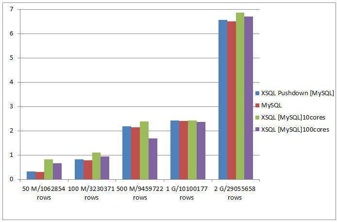

# MySQL性能测试报告

MySQL性能测试报告是基于业务数据的性能测试报告。

## 测试环境

**操作系统**：     CentOS release 6.2 （Final）

**虚拟机版本**：  Java HotSpot(TM) 64-Bit Server VM (build 25.60-b23, mixed mode)

**xsql配置**：

- Driver Memory： 5G
- Executor Inatances: 10或100
- Executor Memory： 5G

## 测试目标

本次测试涵盖性能测试与功能测试，主要包含两个目的：

> - 展示XSQL在针对单数据源、多数据源的sql解析及执行能力

> - 找出XSQL在复杂SQL处理以及大规模数据集计算时存在的问题

## 测试数据集的大小

| 数据源 | 50 M/1062854 rows                       | 100 M/3230371 rows                  | 500 M/9459722 rows                           | 1 G/10100177 rows                                | 2 G/29055658 rows                         |
| ------ | --------------------------------------- | ----------------------------------- | -------------------------------------------- | ------------------------------------------------ | ----------------------------------------- |
| MySQL  | db_share.rpt_mso_english_result_q_daily | db_share.rpt_shouyou_week_retention | db_share.rpt_360game_plugin_new_report_daily | db_share.rpt_mso_chns_360aphone_query_pvuv_daily | db_share.rpt_cloudlive_errornum_all_daily |

## 测试语句集

- 选择操作

  | 编号 | SQL                                                          |
  | ---- | ------------------------------------------------------------ |
  | 1    | select count(id) from rpt_mso_english_result_q_daily where id is not null |
  | 2    | select count(id) from rpt_shouyou_week_retention where id is not null |
  | 3    | select count(id) from rpt_360game_plugin_new_report_daily where id is not null |
  | 4    | select count(id) from rpt_mso_chns_360aphone_query_pvuv_daily where id is not null |
  | 5    | select count(id) from rpt_cloudlive_errornum_all_daily where id is not null |

- 聚合操作

  | 编号 | SQL                                                          |
  | ---- | ------------------------------------------------------------ |
  | 1    | select thedate,count(id),sum(pv1),avg(uv1) from rpt_mso_english_result_q_daily where id is not null group by thedate |
  | 2    | select thedate,count(id),sum(cnt),avg(margin) from rpt_shouyou_week_retention where id is not null group by thedate |
  | 3    | select thedate,count(id),sum(mids),avg(mids) from rpt_360game_plugin_new_report_daily where id is not null group by thedate |
  | 4    | select thedate,count(id),sum(pv),avg(uv) from rpt_mso_chns_360aphone_query_pvuv_daily where id is not null group by thedate |
  | 5    | select thedate,count(id),sum(times),avg(times) from rpt_cloudlive_errornum_all_daily where id is not null group by thedate |

- 子查询操作

  | 编号 | SQL                                                          |
  | ---- | ------------------------------------------------------------ |
  | 1    | select id,q from rpt_mso_english_result_q_daily where id in (select id from dim_qwdesktop_pids where id is not null) |
  | 2    | select id,channel from rpt_shouyou_week_retention  where id in (select id from dim_qwdesktop_pids where id is not null) |
  | 3    | select id,ver from rpt_360game_plugin_new_report_daily where id in (select id from dim_qwdesktop_pids where id is not null) |
  | 4    | select id,version from rpt_mso_chns_360aphone_query_pvuv_daily where id in(select id from dim_qwdesktop_pids where id is not null) |
  | 5    | select id, er from rpt_cloudlive_errornum_all_daily where id in (select id from dim_qwdesktop_pids where id is not null) |

- 连接操作

  | 编号 | SQL                                                          |
  | ---- | ------------------------------------------------------------ |
  | 1    | select a.pv1,b.pid from dim_qwdesktop_pids b  join rpt_mso_english_result_q_daily a on b.id = a.id |
  | 2    | select a.channel,b.pid from dim_qwdesktop_pids b join rpt_shouyou_week_retention  a on b.id = a.id |
  | 3    | select a.ver,b.pid from dim_qwdesktop_pids b join rpt_360game_plugin_new_report_daily a on a.id = b.id |
  | 4    | select a.version,b.pid from dim_qwdesktop_pids b join rpt_mso_chns_360aphone_query_pvuv_daily a on b.id = a.id |
  | 5    | select a.cid,b.pid from dim_qwdesktop_pids b join rpt_cloudlive_errornum_all_daily a on b.id = a.id |

## 测试结果 （单位：秒）

- 选择操作

  |                        | 50 M/1062854 rows | 100 M/3230371 rows | 500 M/9459722 rows | 1 G/10100177 rows | 2 G/29055658 rows |
  | ---------------------- | ----------------- | ------------------ | ------------------ | ----------------- | ----------------- |
  | MySQL                  | 0.3108            | 0.7944             | 2.14               | 2.408             | 6.512             |
  | XSQL Pushdown [MySQL]  | 0.3342            | 0.8236             | 2.187              | 2.433             | 6.56              |
  | XSQL [MySQL] 10 cores  | 0.8194            | 1.097              | 2.3772             | 2.4212            | 6.858             |
  | XSQL [MySQL] 100 cores | 0.6592            | 0.9368             | 1.6762             | 2.3554            | 6.701             |

  

- 聚合操作

  |                        | 50 M/1062854 rows | 100 M/3230371 rows | 500 M/9459722 rows | 1 G/10100177 rows | 2 G/29055658 rows |
  | ---------------------- | ----------------- | ------------------ | ------------------ | ----------------- | ----------------- |
  | MySQL                  | 1.3268            | 3.9434             | 11.916             | 15                | 95.5718           |
  | XSQL Pushdown [MySQL]  | 1.4412            | 4.0342             | 11.9726            | 15.1388           | 95.7764           |
  | XSQL [MySQL] 10 cores  | 3.0158            | 4.1242             | 10.2626            | 7.5206            | 20.182            |
  | XSQL [MySQL] 100 cores | 1.1198            | 2.0068             | 4.4312             | 5.2076            | 11.0678           |

  

- 子查询操作

  |                        | 50 M/1062854 rows | 100 M/3230371 rows | 500 M/9459722 rows | 1 G/10100177 rows | 2 G/29055658 rows |
  | ---------------------- | ----------------- | ------------------ | ------------------ | ----------------- | ----------------- |
  | MySQL                  | 0.071             | 0.0712             | 0.0634             | 0.0686            | 0.0732            |
  | XSQL Pushdown [MySQL]  | 0.0906            | 0.093              | 0.0994             | 0.0972            | 0.1024            |
  | XSQL [MySQL] 10 cores  | 3.2938            | 3.2064             | 9.701              | 9.6808            | 19.2942           |
  | XSQL [MySQL] 100 cores | 2.177             | 2.0992             | 5.6532             | 3.619             | 8.1348            |

  

- 连接操作

  |                        | 50 M/1062854 rows | 100 M/3230371 rows | 500 M/9459722 rows | 1 G/10100177 rows | 2 G/29055658 rows |
  | ---------------------- | ----------------- | ------------------ | ------------------ | ----------------- | ----------------- |
  | MySQL                  | 0.0726            | 0.0732             | 0.0648             | 0.0686            | 0.0714            |
  | XSQL Pushdown [MySQL]  | 0.0732            | 0.1136             | 0.1112             | 0.0948            | 0.0936            |
  | XSQL [MySQL] 10 cores  | 1.8602            | 2.6942             | 7.1488             | 11.2076           | 21.9634           |
  | XSQL [MySQL] 100 cores | 1.4092            | 1.9544             | 3.6058             | 4.1024            | 11.534            |

  

## 结论

- XSQL [Pushdown]相比于MySQL命令行，执行性能仅有约50毫秒的损耗
- XSQL借助于Spark执行时，对于选择操作，其性能和下推执行相差不多；对于聚合操作，执行的效率明显提升，而且申请的资源越多，执行速度越快；对于子查询和连接操作，性能较差。

**Note**

以上结论的得出受数据量、SQL语句及测试环境的影响，仅供参考。
