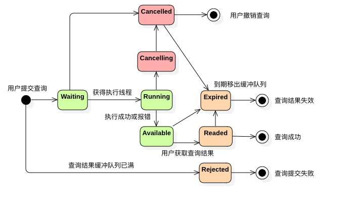

​	XSQL作为统一的查询平台，必然需要提供丰富的接口形式。XSQL目前支持CLI、Scala、Java、Thrift、HTTP REST、JDBC等六种类型的API，本文将逐一进行介绍。

## CLI

​	命令行接入XSQL，可以参考[Running](../../getting_started/Getting_Started/#running)一节的内容，在此不再赘述。

## Scala

在使用Scala API开发之前，请先从maven仓库下载XSQL的相关jar包。下面给出一个例子：

```scala
object XSQLScalaExample{
  def main(args: Array[String]) {
    val spark = SparkSession
      .builder()
      .enableXSQLSupport()
      .appName("XSQL Scala Example")
      .getOrCreate()
    spark.sql("SELECT * FROM src").show()
    spark.stop()
  }
}
```

将XSQLScalaExample打成jar包后，使用${XSQL_HOME}/bin/spark-submit命令进行提交即可。

## Java

在使用Java API开发之前，请先从maven仓库下载XSQL的相关jar包。下面给出一个例子：

```java
public class XSQLJavaExample {

	public static void main(String[] args) {
		SparkSession spark = SparkSession
				.builder()
		    	.appName("XSQL Java Example")
		    	.enableXSQLSupport()
		    	.getOrCreate();
		spark.sql("SELECT * FROM src").show();
    	spark.stop();
	}

}
```

将XSQLJavaExample打成jar包后，使用${XSQL_HOME}/bin/spark-submit命令进行提交即可。

## Thrift

​	Hive和Spark都提供了对Thrift协议的支持，XSQL也不例外。你可以使用多种语言按照Thrift协议进行开发。这里仅给出Java语言的。

**QueryTool.java**

```java
public class QueryTool {
    public static TTransport getSocketInstance(String host, int port, String USER, String PASSWORD) throws TTransportException {
        TSocket tSocket = new TSocket(host, port);
        tSocket.setTimeout(100000);
        return tSocket;
    }

    public static TOpenSessionResp openSession(TCLIService.Client client) throws TException {
        TOpenSessionReq openSessionReq = new TOpenSessionReq();
        return client.OpenSession(openSessionReq);
    }

}
```

**QueryInstance.java**

```java
public class QueryInstance {
  private static String host = "127.0.0.1";
  private static int port = 10000;
  private static String username = "test";
  private static String passsword = "";
  private static TTransport transport;
  private static TCLIService.Client client;
  private TOperationState tOperationState = null;
  private Map<String, Object> resultMap = new HashMap<String, Object>();

  static {
    try {
      transport = QueryTool.getSocketInstance(host, port, username,
          passsword);
      client = new TCLIService.Client(new TBinaryProtocol(transport));
      transport.open();
    } catch (TTransportException e) {
      System.out.println("hive collection error!");
    }
  }

  public TOperationHandle submitQuery(String command) throws Exception {
    TOperationHandle tOperationHandle;
    TExecuteStatementResp resp = null;

    TSessionHandle sessHandle = QueryTool.openSession(client)
        .getSessionHandle();

    TExecuteStatementReq execReq = new TExecuteStatementReq(sessHandle,
        command);
    // 异步运行
    execReq.setRunAsync(true);
    // 执行sql
    resp = client.ExecuteStatement(execReq);// 执行语句

    tOperationHandle = resp.getOperationHandle();// 获取执行的handle

    if (tOperationHandle == null) {
      // 语句执行异常时，会把异常信息放在resp.getStatus()中。
      throw new Exception(resp.getStatus().getErrorMessage());
    }
    return tOperationHandle;
  }

  public String getQueryLog(TOperationHandle tOperationHandle) throws Exception {
    String log = "";
    return log;
  }

  public TOperationState getQueryHandleStatus(TOperationHandle tOperationHandle) throws Exception {
    if (tOperationHandle != null) {
      TGetOperationStatusReq statusReq = new TGetOperationStatusReq(
          tOperationHandle);
      TGetOperationStatusResp statusResp = client
          .GetOperationStatus(statusReq);
      tOperationState = statusResp.getOperationState();
    }
    return tOperationState;
  }

  public List<String> getColumns(TOperationHandle tOperationHandle) throws Throwable {
    TGetResultSetMetadataResp metadataResp;
    TGetResultSetMetadataReq metadataReq;
    TTableSchema tableSchema;
    metadataReq = new TGetResultSetMetadataReq(tOperationHandle);
    metadataResp = client.GetResultSetMetadata(metadataReq);
    List<TColumnDesc> columnDescs;
    List<String> columns = null;
    tableSchema = metadataResp.getSchema();
    if (tableSchema != null) {
      columnDescs = tableSchema.getColumns();
      columns = new ArrayList<String>();
      for (TColumnDesc tColumnDesc : columnDescs) {
        columns.add(tColumnDesc.getColumnName());
      }
    }
    return columns;
  }

  /**
  * 获取执行结果 select语句
  */
  public List<Object> getResults(TOperationHandle tOperationHandle) throws Throwable {
    TFetchResultsReq fetchReq = new TFetchResultsReq();
    fetchReq.setOperationHandle(tOperationHandle);
    fetchReq.setMaxRows(1000);
    TFetchResultsResp re = client.FetchResults(fetchReq);
    List<TColumn> list = re.getResults().getColumns();
    List<Object> list_row = new ArrayList<Object>();
    for (TColumn field : list) {
      if (field.isSetStringVal()) {
        list_row.add(field.getStringVal().getValues());
      } else if (field.isSetDoubleVal()) {
        list_row.add(field.getDoubleVal().getValues());
      } else if (field.isSetI16Val()) {
        list_row.add(field.getI16Val().getValues());
      } else if (field.isSetI32Val()) {
        list_row.add(field.getI32Val().getValues());
      } else if (field.isSetI64Val()) {
        list_row.add(field.getI64Val().getValues());
      } else if (field.isSetBoolVal()) {
        list_row.add(field.getBoolVal().getValues());
      } else if (field.isSetByteVal()) {
        list_row.add(field.getByteVal().getValues());
      }
    }
    for (Object obj : list_row) {
      System.out.println(obj);
    }
    return list_row;
  }

  public void cancelQuery(TOperationHandle tOperationHandle) throws Throwable {
     if (tOperationState != TOperationState.FINISHED_STATE) {
       TCancelOperationReq cancelOperationReq = new TCancelOperationReq();
       cancelOperationReq.setOperationHandle(tOperationHandle);
       client.CancelOperation(cancelOperationReq);
     }
  }
}
```

**Test.java**

```java
public class Test {
	public static void main(String[] args) {
		try {
			QueryInstance base = new QueryInstance();
			String sql = "SELECT * FROM src";
			TOperationHandle handle = base.submitQuery(sql);
			TOperationState state = base.getQueryHandleStatus(handle);
			while(state.equals(TOperationState.RUNNING_STATE) || state.equals(TOperationState.INITIALIZED_STATE)) {
				TimeUnit.SECONDS.sleep(1);
				state = base.getQueryHandleStatus(handle);
			}
			if (state.equals(TOperationState.FINISHED_STATE)) {
				base.getResults(handle);
			}
		} catch (Throwable e) {
			e.printStackTrace();
		}
	}
}
```

## HTTP REST

​	XSQL使用 [Apache Livy](http://livy.incubator.apache.org/) 实现Restful服务，这里内置了 [Livy REST API](./rest-api.md)，这里是帮助您快速开始的 [Livy接口使用Demo(JAVA、PHP)](https://www.notion.so/Livy-Demo-5c50bbbec1414e23acad4b2c7856192a) 。XSQL对Livy的结果缓存机制进行了优化，优化后的Livy查询状态图如下：



这里列举了使用XSQL Restful服务之前，务必知晓的配置项：

| Property Name                           | Default | Meaning                                                      |
| --------------------------------------- | ------- | ------------------------------------------------------------ |
| livy.rsc.sql.interpreter.threadPool.size | 1     | **执行线程池的大小**，即最多x个查询处于Running状态（所有执行线程共用一个SparkSession，建议配置为5） |
| livy.rsc.retained-statements            | 100     | 查询结果**缓冲队列的大小**                                   |
| livy.rsc.result-discard.timeout         | 10m     | **查询过期时间**，当用户获取查询结果之后，状态由Available变为Readed，10分钟后自动变为Expired，当缓冲队列空间不足时，可能被移出缓冲队列。（不接受小数，时间单位=[us,ms,s,m,min,h,d]）（0s表示阅后即焚） |
| livy.rsc.result-retained.timeout        | 1h      | **查询过期时间**，若用户在查询结果Available的1个小时之内，仍未获取查询结果，则状态自动变为Expired。 |
| livy.rsc.server.session.timeout             | 0h     | **Session过期时间**，若xx个小时之内，SparkSession未收到任何查询请求，将自动关闭，0h表示永不过期。 |

**为了帮助您合理利用集群资源，我们为每个Session维持了SessionState。**

- idle: 当已提交的查询数小于livy.rsc.sql.interpreter.threadPool.size时，SessionState为idle，此时提交的查询可以立即获得执行线程，查询状态表现为Running。
- busy: 当已提交的查询数大于livy.rsc.sql.interpreter.threadPool.size，小于livy.rsc.retained-statements时，SessionState为busy，此时提交查询进行FIFO等待，查询状态表现为Waiting。
- exhaust: 当已提交的查询数等于livy.rsc.retained-statements时，SessionState为exhaust，此时提交的查询将被拒绝服务，查询状态表现为Rejected。用户可以选择外部程序轮询等待，也可以选择申请创建新的Sesssion。 

**推荐的使用方式：**建议总是保持一个或多个长驻的Sesssion，当并发数不足时，利用livy.rsc.server.session.timeout创建可自动销毁的Session，从而最大程度的实现即时查询同时节省队列资源。

我们在 [http://client01v.qss.zzzc.qihoo.net:11224/#/](http://client01v.qss.zzzc.qihoo.net:11224/#/) 为您提供了Zeppelin页面，用公司域账号登录后，创建Livy类型的note，就可以试用XSQL的各种功能了。该页面由XSQL团队提供给XSQL用户学习以及测试使用，内置的xsql试用部署包含四种数据源：hive、es、mysql、redis，均为测试数据库（只读权限）。

如果您想要访问自己的数据源，可以加入一个云图项目，由项目负责人向weiwenda@360.cn申请XSQL Restful服务，申请成功后在note页面将出现 `your_project项目部署` 的可选下拉。

具体的操作流程如视频所示：

<video width="100%" controls poster="../../images/zeppelin使用介绍.png">
  <source src="../../images/zeppelin使用介绍.mp4" type="video/mp4">
    Your browser does not support the video tag.
</video>

## JDBC

​	Hive和Spark都提供了对JDBC的支持，XSQL也不例外。这里给出Java语言使用JDBC连接XSQL的例子。

```java
public class XSQLJdbcExample {

	private static String driverName = "org.apache.hive.jdbc.HiveDriver";

	public static void main(String[] args) throws SQLException {
    	try {
        	Class.forName(driverName);
    	} catch (ClassNotFoundException e) {
        	e.printStackTrace();
        	System.exit(1);
    	}

    	Connection con = null;
    	Statement stmt = null;
    	ResultSet res = null;
		try {
			con = DriverManager.
				getConnection("jdbc:hive2://127.0.0.1:10000/test;auth=noSasl",
            	"test", "test");
			stmt = con.createStatement();
			String sql = "SELECT * FROM src";
			res = stmt.executeQuery(sql);
			while (res.next()) {
	        	System.out.println(res.getString("ip"));
	        }
		} catch (Exception e) {
			e.printStackTrace();
		} finally {
			if (res != null) {
				res.close();
			}
			if (stmt != null) {
				stmt.close();
			}
			if (con != null) {
				con.close();
			}
		}
	}
}
```

由于XSQL继承了HIVE实现JDBC的设计，因此这里的JDBC Driver依然是org.apache.hive.jdbc.HiveDriver。